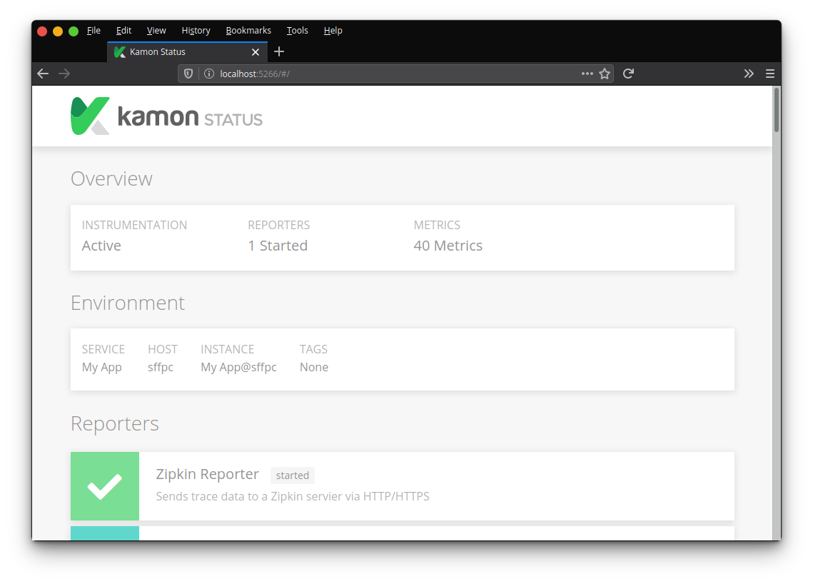
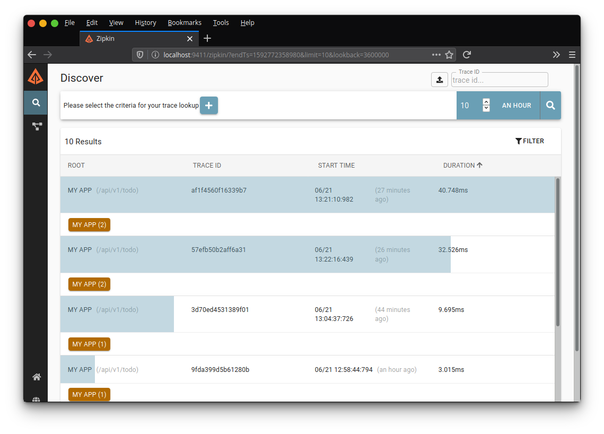
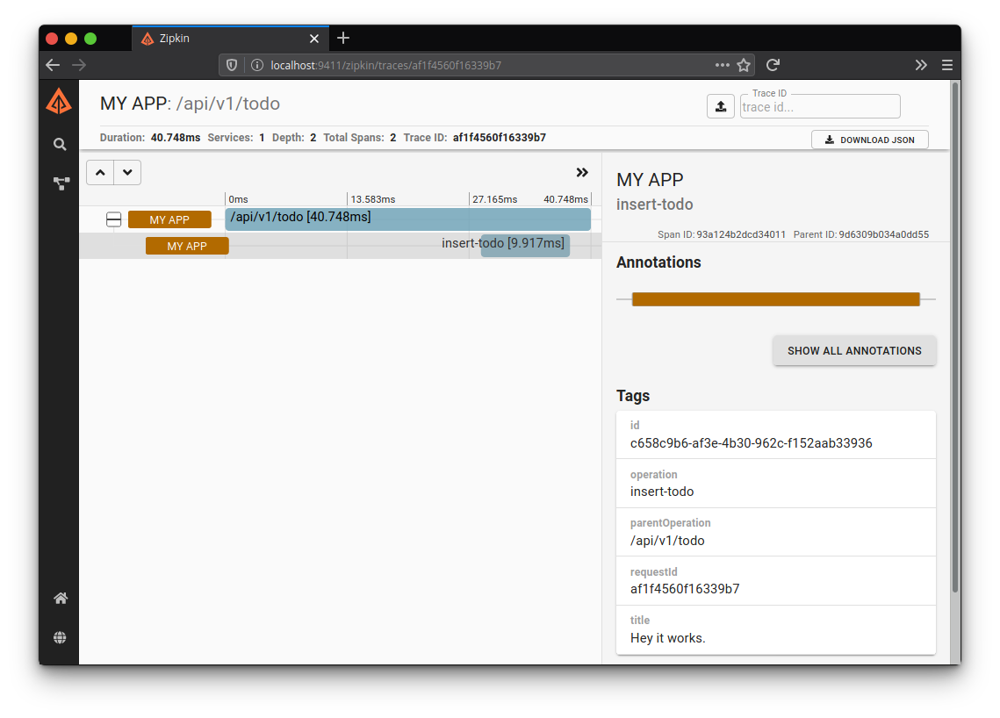

# Akka Tracing Demo

A simple tracing demo written in Scala with Akka Http. It uses Kamon and Zipkin to capture and report spans.
Using the requestId in HTTP headers and  logs, you can view (trace) requests as they traverse your application code.

Requires [JDK 11](https://adoptopenjdk.net/) and [sbt 1.3+](https://www.scala-sbt.org/).

## Start

1. Download and run Zipkin:

```bash
$ curl -sSL https://zipkin.io/quickstart.sh | bash -s
$ java -jar zipkin.jar
```

2. Start the Akka Http server:

```bash
$ cd akka-tracing-demo
$ sbt run
```

## Kamon

3. Verify the instrumentation is ready by checking the Kamon status page: http://localhost:5266/



Kamon will collect some [default metrics about Akka Http](https://kamon.io/docs/latest/instrumentation/akka-http/), as well as any
custom metrics you have in your code. These look like:

```scala
val insertSpan = Kamon.spanBuilder("insert-todo")
  .tag("id", newTodo.id.toString)
  .tag("title", newTodo.title) // custom tags
  .start()
insertSpan.finish()
```

Kamon is configured in `application.conf` to automatically use `X-Request-ID` header for
tracing each HTTP call, and appends this header to outgoing responses too.
In this demo code, its fetched and used in the log output, so you can easily
view individual traces and what logs they output:

```scala
# fetch the traceId / X-Request-ID
val requestId = Kamon.currentSpan().trace.id.string
```

```bash
# all logs are prefixed with the [traceId].
[info] 13:22:16.439 [INFO ] [57efb50b2aff6a31] HTTP/1.1 POST /api/v1/todo
[info] 13:22:16.455 [DEBUG] [57efb50b2aff6a31] Creating todo.
[info] 13:22:16.471 [DEBUG] [57efb50b2aff6a31] Created todo: 27646f9d-e435-4679-8eb3-de762f3f5126
``` 

## Send some requests

4. Make a few HTTP calls to the REST API:

```bash
$ curl -X GET "127.0.0.1:8080/api/v1/todo"
$ curl -X POST "127.0.0.1:8080/api/v1/todo" -d "{\"title\":\"Hey it works.\"}"
$ curl -X GET "127.0.0.1:8080/api/v1/todo/<id>"
$ curl -X DELETE "127.0.0.1:8080/api/v1/todo/<id>"
```

It might take a few minutes for spans to be sent to Zipkin after these calls are made.

## View Traces

5. Open the Zipkin UI and either search for recent spans, or enter a requestId in the search box.



Click on a trace to view more details.



The spans are timed and tagged, revealing where an individual request spent its time
in your application code, if any branches were taken, and how long they took.

In a microservice architecture, if each service had Kamon and was configured to use
the `X-Request-ID` header for tracing, then you get the advantage of being able to
trace individual requestIds across service logs, and view them all in one place!